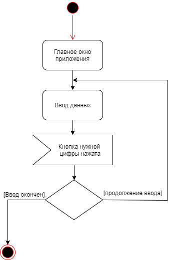
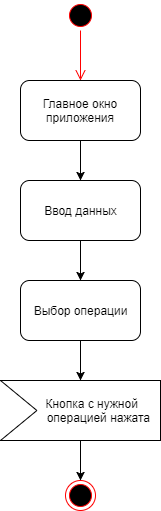
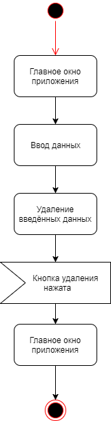
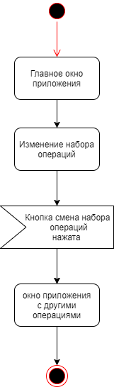

# Диаграммы активностей
---
# Содержание
1 [Ввод операнд](#oper)  
2 [Выбор операции](#znak)  
3 [Очистка экрана](#clear)  
4 [Изменение набора операций](#change)

<a name="oper"/>

# 1 Ввод операнд

<a name="znak"/>

# 2 Выбор операции

<a name="clear"/>

# 3 Очистка экрана

<a name="change"/>

# 4 Изменение набора операций

